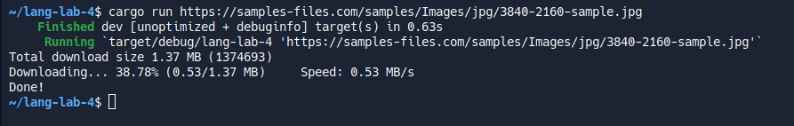
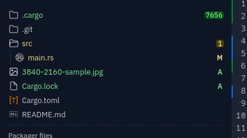

# Programming Languages
## Lab 4 - Rust
[replit](https://replit.com/@romchestplay/lang-lab-4#src/main.rs)
### Running
Replit -> Shell ->
`cargo run <url>`
### Example URLs
- [Image](https://samples-files.com/samples/Images/jpg/3840-2160-sample.jpg)
- [100 MB file](https://ash-speed.hetzner.com/100MB.bin)
### Screenshots
#### Running program

#### File will appear in root dir

